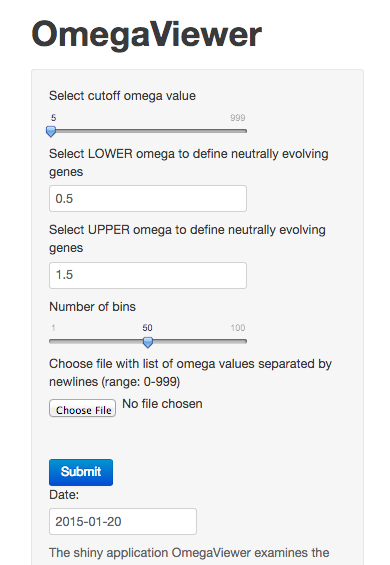
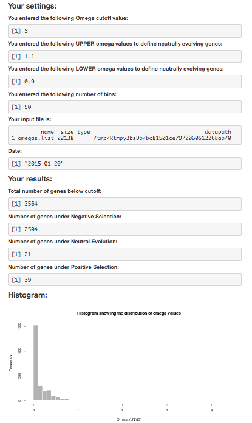

RStudioPresenterCourseProject
========================================================
author: Lorenzo Carretero-Paulet
date: Tue Jan 20 18:32:26 2015
transition: rotate
autosize: true

Introduction 
===

Selection may differentially act on nonsynonymous (amino acid-changing; dN) substitutions compared to the putatively neutral synonymous (silent; dS) ones. 

1. Under the NEUTRAL model of EVOLUTION, synonymous and non-synonymous substitutions accumulate at the same rate (*Omega: ω ∼ 1*).
2. Conversely, deviations from this pattern evidence the action of purifying or NEGATIVE SELECTION (purges deleterious mutations to conserve the protein structure and function; *Omega: ω << 1*), 
3. or the action of POSITIVE SELECTION  promoting the fixation of non-synonymous mutations with advantageous fitness effects (*Omega: ω > 1)*. 

Estimation of ω therefore yields insights on the molecular evolutionary mechanisms of gene/protein specialization and functional diversification. 

Description of OmegaViewer 
===

I wrote the shiny application **OmegaViewer** to examine the distribution of Omega values (dN/dS) from a file containing a list of estimates of Omega values for groups of genes.  Please, see below the summary and head of the omegas.list test file provided.


```r
omegaVector <- as.numeric(readLines(infile))
summary(omegaVector)
```

```
   Min. 1st Qu.  Median    Mean 3rd Qu.    Max. 
    0.0     0.0     0.1   136.0     0.5   999.0 
```

```r
head(omegaVector)
```

```
[1]   0.00010   0.00011   0.48290   0.31715 999.00000   0.00010
```

Side Bar Panel of OmegaViewer 
===

***
I used a slider widget to select a Omega cutoff value from a range (0-999). To define the range of Omega values to classify a particular family of genes as evolving neutrally I used two input controls to enter LOWER and UPPER Omega values (range: 0.5-1.5). An additional slider widget was used to define the number of bins used in the histogram. To upload the file containing the Omega values to be examined I created a file upload control.

Main Panel of OmegaViewer 
===

***
Once the previous values have been selected by the user a submit button sends the input data to the application. The application then returns the total number of genes below the Omega cutoff value selected, the number of genes classified as evolving under Negative, Neutral and Positive Selection, as well as an histogram representing the distribution of Omega values. 

Please, click [here](https://lcarretero.shinyapps.io/ShinyCourseProject/) to launch the application.
Find source code at [here](https://github.com/Darwinita/ShinyCourseProject).
